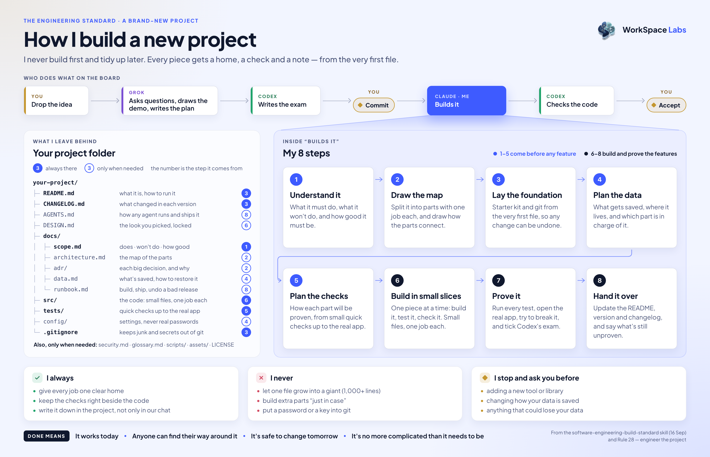

# An engineering standard for AI agents

**AI agents can build software that works today and is painful to change next month. A better prompt doesn't fix that. A standard the agent follows from the first file does.**

This is that standard, packaged as an Agent Skill. It makes structure, clear ownership, tests, documentation and Git hygiene part of the build instead of a clean-up job for later — and it scales down, so a small project stays small.

It is tool-agnostic. Nothing here depends on a particular model, CLI, or framework.

The skill is in this repo — [`skills/`](skills).

---

## In practice



*The standard at work on the author's own board. One agent plans, one writes the exam and reviews the code, one builds — and a person holds every gate.*

---

## What it asks of an agent

- **Size the work first.** A typo gets the smallest safe change. A new project gets its requirements, a map of its parts, a data model and a test plan before the first feature.
- **Give every job one home.** No god files. Product rules stay out of the screens and the storage.
- **Build the tests and the docs with the code**, not after it.
- **Don't over-engineer.** No layer, interface, framework or folder without a real problem it solves.
- **Leave the big calls to the owner.** Replacing the architecture, changing how data is stored, or anything that could lose data waits for a person.

---

## Use it

```bash
git clone https://github.com/itsmk91/agent-engineering-standard.git
cp -R agent-engineering-standard/skills/software-engineering-build-standard ~/.claude/skills/
```

Codex reads `~/.codex/skills/` instead; the skill ships the `agents/openai.yaml` it expects.

Agents load it on their own when they build, extend, restructure or review software. The core is one page — [`SKILL.md`](skills/software-engineering-build-standard/SKILL.md) — and four reference files load only when the work needs them. A project's own rules, its recorded decisions and the owner's instructions always come first.

---

## What it costs

- **Slower first steps.** A new project spends its opening on a map, a data model and a test plan instead of features.
- **More questions for the owner.** Big decisions wait for a person, and some of those waits will feel slow.
- **It can't rescue a bad idea.** A standard shapes how something is built, not whether it was worth building.

**Worth it when:** the software has to outlive the week, or more than one agent or person will change it.

**Not worth it when:** it's a throwaway prototype. The standard itself says to keep those minimal.

---

## The shortest version

> Never build first and organize later. Give every piece a home, a check and a note from the first file — and keep it no more complicated than the product needs.

---

<sub>by Workspace Labs · Drawn from a working system, not a thought experiment — see <a href="https://github.com/itsmk91/workspace">a showcase of it running</a>, and the patterns beside it: <a href="https://github.com/itsmk91/agent-health-checks">health checks for AI agents</a> and <a href="https://github.com/itsmk91/agent-separation-of-duties">separation of duties for AI agents</a>.</sub>
